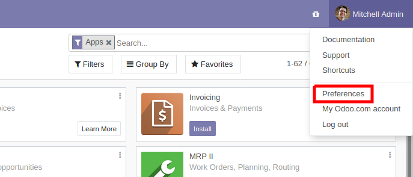

=========================
Two-factor Authentication
=========================

.. versionadded:: 14.0

Two-factor authentication ("2FA") is the act of using multiple factors
(or methods) before accepting that a user is who they are. These
factors are usually "something the user knows" (a password for
instance), "something the user has" (e.g. a key of some sort), or
"something the user is" (e.g. biometric data).

The goal is to make it more difficult for an attacker to get access to
the account: with single-factor authentication, if somebody manages to
guess or find your password, the account is completely
compromised. With an additional factor, there are more hurdles an
attacker needs to clear before they can access the account.

Odoo currently supports :abbr:`2FA (two-factor authentication)` using
*Time-based One-Time Passwords* (TOTP).

This is the "something you own" category of factors: during the
:abbr:`TOTP (time-based one-time password)` pairing process, you store
a shared secret inside an *authenticator* (usually a program on your
smartphone, although dedicated hardware devices are also
available). At log-in, after you have input your password, Odoo will
request a 6-digit *verification code*. This code is provided by your
authenticator based on the shared secret and the current time.

This means an attacker needs *both* to have guessed (or found) your
password and to access (or steal) your authenticator, a more difficult
proposition than either one or the other.

Requirements
============

.. note:: these lists are just examples, they are not endorsements or
          any specific software

If you don't already have one, you will need to choose an
authenticator.

Phone-based authenticators are the easiest and most common so we will
assume you'll pick and install one on your phone, examples include
`authy <https://authy.com/>`_, `freeotp
<https://freeotp.github.io/>`_, `google authenticator
<https://support.google.com/accounts/answer/1066447?hl=en>_, `lastpass
authenticator <https://lastpass.com/auth/>`_, `microsoft authenticator
<https://www.microsoft.com/en-gb/account/authenticator?cmp=h66ftb_42hbak>`_,
...; password managers also commonly include :abbr:`2FA (two-factor
authentication)` support e.g. `1password
<https://support.1password.com/one-time-passwords/>`_, `bitwarden
<https://bitwarden.com/help/article/authenticator-keys/>`_, ...

For the sake of demonstration we will be using Google Authenticator
(not because it is any good but because it is quite common).

Setting up two-factor authentication
====================================

Once you have your authenticator of choice, go to the Odoo instance
you want to setup :abbr:`2FA <two-factor authentication>`, the open
:guilabel:`Preferences` (or :guilabel:`My Profile`):

Open the :guilabel:`Account Security` tab, then click the
:guilabel:`Enable two-factor authentication` button:

.. figure:: preference screen

Because this is a security-sensitive action, you will need to input
your password:

.. figure:: secure area

After which you will see this screen with a barcode:

.. figure:: totp popup

In most applications, you can simply *scan the barcode* via the
authenticator of your choice, the authenticator will then take care of
all the setup:

.. figure:: authenticator screenshot w/ scan barcode

.. note::

   if you can not scan the screen, you can click the provided link, or
   even copy the secret to manually set-up your authenticator:

   .. figure:: outline link and secret

   .. figure:: manual entry

Once this is done, the authenticator should display a *verification
code* with some useful identifying information (e.g. the domain and
login for which the code is). You can now input the code into the
:guilabel:`Verification Code` field, then click the `Enable two-factor
authentication` button.

Congratulation, your account is now protected by two-factor
authentication!

Logging in
==========

You should now :guilabel:`Log out` to follow along.

On the login page, input the username and password of the account for
which you set up :abbr:`2FA (two-factor authentication)`, rather than
immediately enter Odoo you will now get a second log-in screen:

.. figure:: 2fa screen

Get your authenticator, input the code it provides for the domain and
account, validate, and you're now in.
